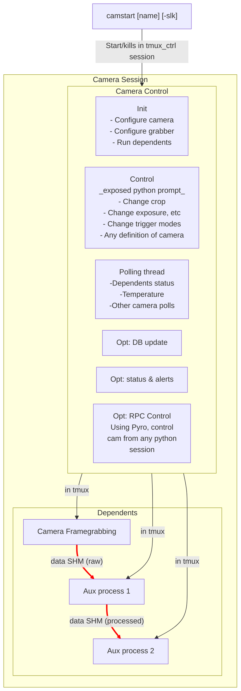
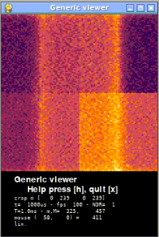

# Camstack

Camera session manager developed for Subaru/SCExAO

## Installation

- Install [pyMilk](https://github.com/milk-org/pyMilk) first
- Clone with git.
- `pip install -e .` at repository root.
- Some features (EDT) will _require that the root is `$HOME/src/camstack`.
- Define `CAMSTACK_DEPLOYMENT_ID` to benefit from a custom deployment, and see `camstack/deployment/__init__.py` for how they are defined and used.

## Camera session



## Controlling the camera

There are three ways of controlling the camera:
__Directly at-the-counter__
An interactive python shell is always running in the `camera_ctrl` tmux session. By attaching to this session, the operator can call all the exposed camera methods, e.g. `set_tint(shutter_time)`, `set_camera_mode()`, `set_fps(1e9)`, etc.
__Tmux line injection__
Using the tmux API, the commands above can be sent (shell, python's libtmux) using `tmux send-keys` into the ctrl session
__Python remote objects__
During the startup, the camera object can be bound to a Remote Procedure Call (RPC) object using the `Pyro` package.
This enables remote connection (local and remote) to the control object for any allowable location, and control the camera such as:
```python
cam = connect('CAMERA_IDENTY')
cam.get_tint() # returns current exposure time
cam.set_camera_mode('MY_CUSTOM_CROP') # halts and restart the camera in a different sensor crop mode # the crop is pre-defined in the camera's class.
cam.set_fps(1000) # 1 kHz
```

## Accessing the data

The data pointer is a shared memory object, which is separate from the control object. See [ImageStreamIO](https://github.com/milk-org/ImageStreamIO) and the python bindings [pyMilk](https://github.com/milk-org/pyMilk)
At any python terminal on the local machine
```python
from pyMilk.interfacing.shm import SHM
cam_data = SHM('cam_shm_name')
array = cam_data.get_data() # Get current data, maybe stale
array = cam_data.get_data(True) # Get next published data
array_list = cam.multi_recv_data(100) # Get next 100 frames
```


## Viewers

`pygame` based SHM viewers are distributed with camstack
The package an plugin system to customize their features.

> pygame requires python <= 3.13

Running `anycam.py <shm_name>` (and press `h` for help):



-----

## Deploying new cameras

The class hierarchy is built:
> Base class
> > Common technical basis (e.g. same framegrabber)
> > > Camera model: define control methods for this camera odel)
> > > > Camera identity: define features, keywords, for ONE camera doing ONE job.

Integrating new camera models is more or less easy depending on the existing, and how esoteric the manufacturer's SDK.

An entrypoint is created in the `deployments/` folder for each camera identity, and then the session can be started using
```bash
camstart <camera_nickname>
```

## Misc

### Why separate the framegrabbing from the control

In many science cases, the _camera framegrabbing_ is designed to be a C program with realtime privileges and minimal overhead. On the other hand, it is convenient to keep the camera control and session orchestrator purely in python.

### Where is the framegrabbing code?

Unfortunately, not here until we do a better review of

### Camera startup

See [details (probs not up to date)](doc/DETAILED_CAMERA_INIT.md)

### Changing camera "mode"

Changing "mode" really means **changing crop size**. The framegrabber has to be reconfigured, all SHMs re-instantiated with their new size, etc. Pretty much all steps above are called in the same order.
This is done without quitting at the `<cam>_ctrl` command prompt, by calling `set_camera_mode(some_predefined_mode_id)`.

For dumb cameras (acquisition channel but no control channel), the FG acquisition can be set to an arbitrary size dynamically by calling `set_camera_size(height, width)`.

## Trimmed layout

```bash
├── camstack/                      # __python package root__
│   ├── acq/                       # runnable files for acquisition
│   │   ├── flycapture_grab.py     #     with PyCapture2
│   │   ├── spinnaker_grab.py      #     with PySpin
│   │   ├── spinnaker_over_transport_grab.py  #     with Spinnaker over transport
│   │   └── simcam_framegen.py     #     frame emitter for simulated camera
│   ├── cam_mains/                 # Exec entrypoint for camera personalities, with auxiliary helper processes
│   ├── cams/                      # Camera class hierarchy
│   │   │   # BASE CLASS
│   │   ├── base.py                #     Base class, defining all of a "camera session"
│   │   │   # BACKENDS
│   │   ├── edtcam.py              #     EDT framegrabber base
│   │   ├── autodumbedt.py         #     Dumb EDT camera (as in, grabbing but no serial control, e.g. Andor ixon)
│   │   ├── dcamcam.py             #     DCAM (Hamamatsu) cameras
│   │   ├── flycapturecam.py       #     FLIR/PointGrey via FlyCapture
│   │   ├── spinnakercam.py        #     FLIR via Spinnaker
│   │   ├── flisdkgenicam.py       #     First Light Imaging SDK GeniCam
│   │   ├── params_shm_backend.py  #     Parameter SHM backend - Uses SHM keywords as transport layer between control and framegrabbing process
│   │   │   # MODELS & PERSONALITIES (sometimes in the same file)
│   │   ├── andors_autocamlink.py  #     Andor cameras over CameraLink
│   │   ├── spinnaker_over_transport.py  # Spinnaker over transport layer
│   │   ├── cred1.py               #     C-RED 1 camera
│   │   ├── cred2.py               #     C-RED 2 camera
│   │   ├── nuvu.py                #     Nuvu camera
│   │   ├── ocam.py                #     OCAM2 camera
│   │   ├── prime_bsi.py           #     Prime BSI camera
│   │   ├── ao_apd.py              #     AO APD detector
│   │   ├── vampires.py            #     VAMPIRES camera
│   │   └── simulatedcam.py        #     Simulated camera
│   │                              # Base --> Framegrabber type --> Camera model --> Camera personality
│   ├── core/
│   ├── deployments/               # Deployment files defining which camera personalities are available in each install
│   ├── deprecatedscripts/
│   ├── image_processing.py        # image processing routines
│   ├── main_arch.py               # Schema definitions for deployment
│   ├── main.py                    # __main entrypoint__ for starting camera sessions
│   ├── pyro_keys.py
│   ├── scxkw.py                   # Wrapper around optional keyword + database system
│   ├── utilities/
│   ├── viewerclasses/             # Pygame viewers: classes for viewers tailored to different camera personalities
│   ├── viewermains/               # Pygame viewers: entrypoints for viewer applications
│   └── viewertools/               # Pygame viewers: a plugin stack for the pygame viewers
├── conf/
│   ├── modes/                     # toml files containing e.g. crop modes
│   └── edt_fg_conf/               # cfg files for EDT framegrabbers (cameralink)
├── doc/                           # Documentation
├── ocamdecode/                    # Generation & config files for OCAM2
├── pyproject.toml
├── README.md
├── scripts/                       # Custom utilities & legacy deployment scripts
├── setup.py
└── tests/                         # pytest stack
```
